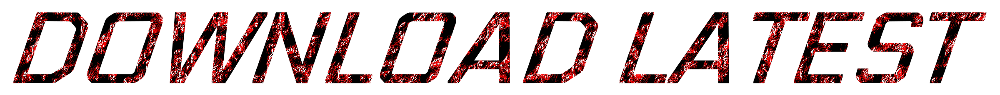

  

        

# !!DANGER!!  
VRChat has recently entered a BAN SPREE and we are unsure of the reason  
If I must I WILL private everything relating to The Black Arms SDX to prevent any issues.  
For now USE AT YOUR OWN RISK!

## Screenshots
<table>
  <tr>
    <th>Login Pane</th>
    <th>LoadBundle Pane</th>
  </tr>
  <tr>
    <th></th>
    <th></th>
  </tr>
  <tr>
    <th>Builder Pane</th>
    <th>Assets Pane</th>
  </tr>
  <tr>
    <th></th>
    <th></th>
  </tr>
  <tr>
    <th>Content Pane</th>
    <th>Settings Pane</th>
  </tr>
  <tr>
    <th></th>
    <th></th>
  </tr>
  <tr>
    <th>Avatar Upload Panel</th>
    <th>World Upload Panel</th>
  </tr>
  <tr>
    <th></th>
    <th></th>
  </tr>
  <tr>
    <th>TGE Utilities</th>
    <th>SDK Utilities</th>
  </tr>
  <tr>
    <th></th>
    <th></th>
  </tr>
  <tr>
    <th>Sentinel Importer</th>
    <th>Sentinel Importer List</th>
  </tr>
  <tr>
    <th></th>
    <th></th>
  </tr>
</table>

## License

**This repository intentionally omits a supplementary license.** Exclusive copyright is held by the contributors.
The source code hosted in this repository may not be copied, distributed, or modified without risk of take-downs, shake-downs, or litigation.
For more information regarding the conditions of use where repositories omit a supplemental license; see [GitHub Terms of Service](https://docs.github.com/en/github/site-policy/github-terms-of-service#d-user-generated-content), or [the summary of 'No License' conditions](https://choosealicense.com/no-permission/).

