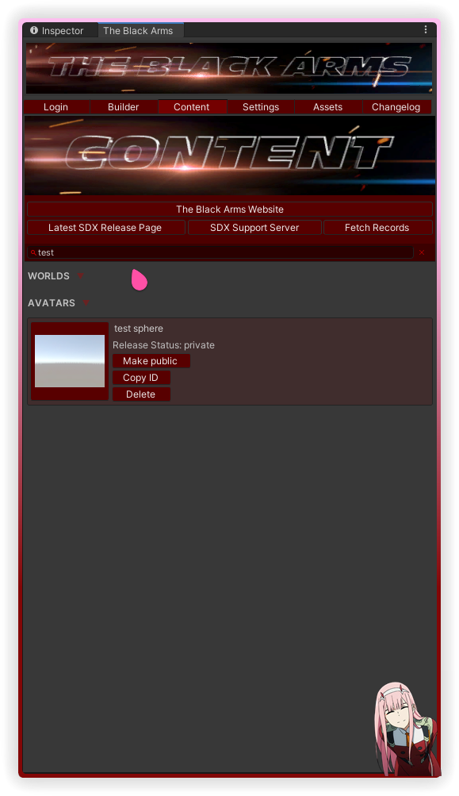
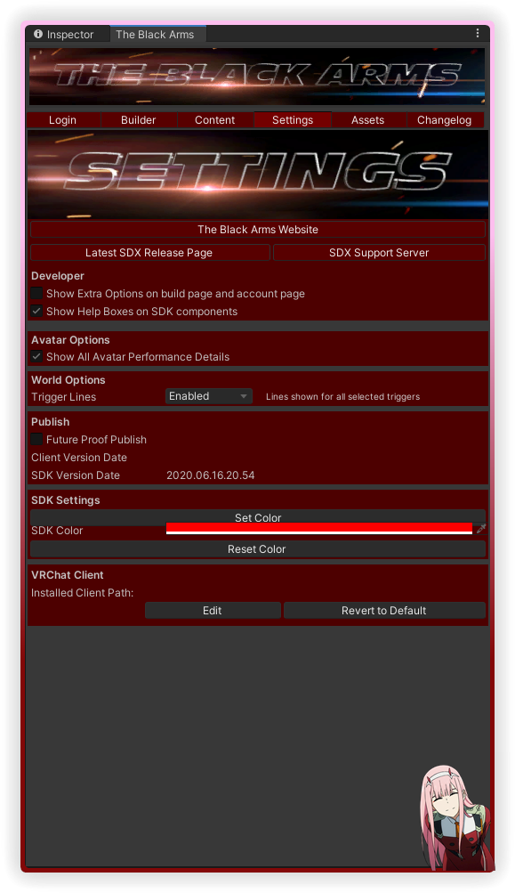
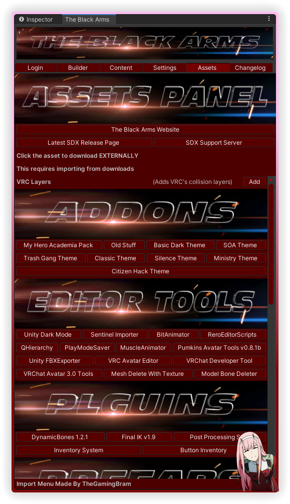
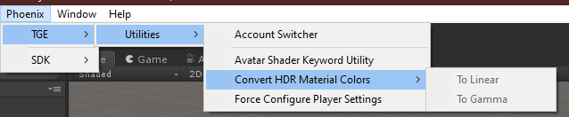

# The Black Arms SDX

  

## [FAQ](./FAQ.md) | [Changelog](./CHANGELOG.md) | [The SDX List](./SDX.md)

## Screenshots

### Login

### Builder

### Content

### Settings

### Assets

### LoadBundle

### TGE Utilities

### SDK Utilities

### Avatar Upload Panel

### World Upload Panel

## License

**This repository intentionally omits a supplementary license.** Exclusive copyright is held by the contributors.
The source code hosted in this repository may not be copied, distributed, or modified without risk of take-downs, shake-downs, or litigation.
For more information regarding the conditions of use where repositories omit a supplemental license; see [GitHub Terms of Service](https://docs.github.com/en/github/site-policy/github-terms-of-service#d-user-generated-content), or [the summary of 'No License' conditions](https://choosealicense.com/no-permission/).
